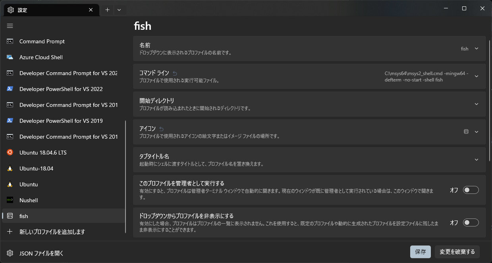
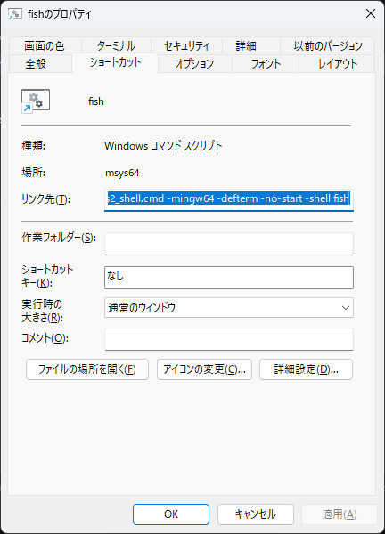

# Fish Shell Configuration for Windows

Windows 上で Fish シェルを使用するための設定と関数を提供

## 前提条件

* Windows 11
* Git for Windows

## Fish の導入

| No. | 説明 | コマンド |
| :-: | --- | --- |
|  1  | [MSYS2](https://www.msys2.org/) をインストール | `winget install msys2.msys2` |
|  2  | MSYS2 を起動 | `C:\msys64\msys2_shell.cmd` |
|  3  | Fish シェルをインストール| `pacman -Syu`<br>`pacman -S fish` |
|  4  | Fish シェルを起動 | `fish` |

## Windows Terminal にプロファイルを追加

* 「新しいプロファイルを追加します」から Windows Terminal に Fish シェルのプロファイルを追加
* 既定値 > 外観 > フォント フェイスを `Cousine Nerd Font` に設定
* フォントのダウンロードは [ここ](https://github.com/ryanoasis/nerd-fonts/raw/master/patched-fonts/Cousine/Regular/CousineNerdFont-Regular.ttf) から

<p align="center">
  
</p>

| 項目 |  値  |
| ---- | ---- |
| 名前 | fish |
| コマンド ライン | `C:\msys64\msys2_shell.cmd -mingw64 -defterm -no-start -shell fish` |

## `Win + R` のショートカットキーを設定

1. [このページ](https://github.com/masachika-kamada/windows-terminal-setting/blob/main/winR_shortcut.md) を参考に、`Win + R` のショートカットキーを設定
2. 適当なショートカットを複製
3. ファイル名を `fish`、コマンドを `C:\msys64\msys2_shell.cmd -mingw64 -defterm -no-start -shell fish` に変更

<p align="center">
  
</p>

## ホームディレクトリの修正

fish に入って `/etc/nsswitch.conf` の `db_home` の値を修正：`notepad /etc/nsswitch.conf`

```/etc/nsswitch.conf
# Begin /etc/nsswitch.conf

passwd: files db
group: files db

db_enum: cache builtin

db_home: /c/Users/[ユーザー名]
db_shell: cygwin desc
db_gecos: cygwin desc

# End /etc/nsswitch.conf
```

## 設定の適用

1. リポジトリをクローン
2. 以下を `~/.config/fish` にコピー
   * `completions/`
   * `conf.d/`
   * `functions/`
   * `config.fish`
   * `fish_config.fish`

## VS Code の設定

VS Code の設定ファイル `settings.json` に以下を追加

```settings.json
{
    "terminal.integrated.defaultProfile.windows": "fish",
    "terminal.integrated.profiles.windows": {
        "fish": {
            "path": "C:\\msys64\\msys2_shell.cmd",
            "args": [
                "-mingw64",
                "-defterm",
                "-no-start",
                "-shell",
                "fish"
            ]
        },
    }
    "terminal.integrated.fontFamily": "FiraCode Nerd Font Mono",
    "terminal.integrated.fontSize": 16,
}
```

## Windows との環境変数の共有

1. PC 起動時に `export_env.ps1` で環境変数を `windows_env.txt` に出力
2. fish 起動時に `windows_env.txt` を読み込んで環境変数を設定

という流れで、Windows との環境変数の共有を行う

1 の `export_env.ps1` を自動実行させるために、タスクスケジューラを使用

### タスクスケジューラの設定

1. タスクスケジューラを起動 (Win + R で `taskschd.msc`)
2. 「タスクの作成」をクリック
3. 全般タブ
   * 名前: `環境変数のエクスポート`
4. トリガータブ > 新規
   * タスクの開始: `ログオン時`
5. 操作タブ > 新規
   * 操作: `プログラムの開始`
   * プログラム/スクリプト: `powershell.exe`
   * 引数の追加: `-File "C:\Users\[user_name]\.config\fish\export_env.ps1"`
   * 開始: `C:\Users\[user_name]\.config\fish`
